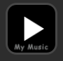
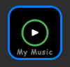
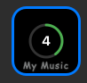
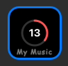
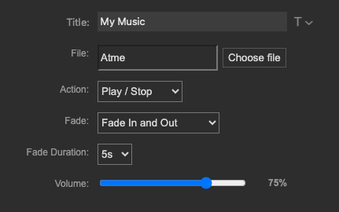

# TheraCue (Stream Deck Audio Player)

TheraCue is a Stream Deck plugin that plays audio files with extended fades, volume control, and visual feedback. It bundles FFmpeg (only macOS for now) so end users do not need to install external dependencies.

## Features

- Plays common audio formats (MP3, WAV, FLAC, M4A, AAC, OGG, etc.)
- Fade in/out up to 30 seconds with smooth, equal-power curves (-60 dB range)
- Volume control per action
- Play modes: Play/Stop toggle, Play once, Play while pressed
- Visual feedback with circular countdowns for fades
- Bundled FFmpeg for macOS (Windows support untested; see below)

## Requirements

- Stream Deck software 6.5+
- macOS 12+ or Windows 10+

## Installation

### From a release build

1. Download the appropriate `.streamDeckPlugin` file.
2. Double-click it to install in Stream Deck.
3. Restart Stream Deck if the action does not appear.

### Manual install

Copy the plugin to:

- macOS: `~/Library/Application Support/com.elgato.StreamDeck/Plugins/`
- Windows: `%appdata%\Elgato\StreamDeck\Plugins/` (untested; please report issues or contribute fixes)

## Usage

1. Drag the "Play Audio" action onto a key.
2. In the property inspector, select an audio file.
3. Choose a play mode, fade settings, and volume.
4. Press the key to play.

UI and Visual Indicators:

- Play icon: idle state  
  
- Green circle: audio is playing  

- Circular countdown timer: green circle indicator is fading in and the red circle indicator is fading out  


- Propery inspector  
  

## How it works

- Audio decoding uses FFmpeg and streams raw PCM to the speaker backend.
- On macOS, the plugin can use `afplay` when no fades or volume control are required.
- Fades are applied per-sample using an equal-power curve for smoother transitions.

## Project structure

- `src/plugin.ts`: Stream Deck plugin entrypoint
- `src/actions/play-audio.ts`: Action logic, playback state, fades, and UI updates
- `src/audio/decoder.ts`: FFmpeg discovery and PCM decoding
- `com.github.andr3van.theracue.sdPlugin/`: Plugin bundle (manifest, UI, assets)

## Development

### Run locally

```bash
npm install
npm run build

# Dev link (symlink into Stream Deck)
npx @elgato/cli link com.github.andr3van.theracue.sdPlugin

# Watch + auto-restart
npm run watch

# Remove dev link
rm ~/Library/Application\ Support/com.elgato.StreamDeck/Plugins/com.github.andr3van.theracue.sdPlugin
```

### Package a plugin

```bash
npm run bundle
```
This will create a `com.github.andr3van.theracue-arm64.streamDeckPlugin` file in the root directory.

## Architecture-specific builds (macOS)

This plugin includes native Node modules (`speaker`) that must match the target CPU architecture. Build on the target architecture to distribute macOS packages:

- Apple Silicon build: `com.github.andr3van.theracue-arm64.streamDeckPlugin`
- Intel build: `com.github.andr3van.theracue-x86_64.streamDeckPlugin`

See `BUILD_INSTRUCTIONS.md` for the Intel build checklist, including replacing `ffmpeg-darwin` and rebuilding `speaker`.

## Bundled FFmpeg

FFmpeg binary lives under `com.github.andr3van.theracue.sdPlugin/bin/ffmpeg/`:

- macOS: `ffmpeg-darwin`

There is currently **no bundled Windows FFmpeg binary**. Windows support is untested. The decoder will attempt to use a system-installed FFmpeg if available on Windows.

## Troubleshooting

- Action not showing: restart Stream Deck, then check logs (Help -> Open Logs Folder).
- No audio: verify file path, format, and logs. Try a shorter file name/path.
- Fade not working: ensure a fade duration is set (e.g., 5s) and that a fade-out effect is enabled (either via "Fade In and Out" or a non-zero "Fade Out" duration).

## Contributing

Issues and pull requests are welcome. For larger changes, open an issue first to discuss direction and testing needs.

## License

[MIT License](LICENSE)

## Support

Open an issue at `https://github.com/andr3van/code-playground`.
